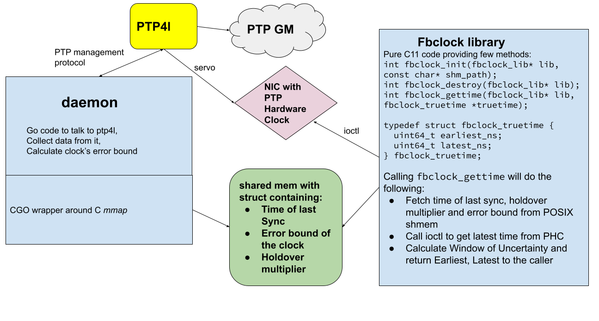

# fbclock

Client C library and stateful Go daemon to provide true time API based on PTP time.

*fbclock* doesn't just provide a single timestamp, instead it provides an [Earliest, Latest] values that incorporate calculated Window of Uncertainty.

The idea is using the math based on observed PTP client metrics like offset/path delay/frequency adjustments that allows estimating the level of uncertaintly for current time taken from the NIC PHC.

Then on each request to the fbclock API the client gets a tuple of [Earliest, Latest] values, with 6-9s guarantee that 'true time' lies withing this range.

## C API

```
// what customers get
typedef struct fbclock_truetime {
  uint64_t earliest_ns;
  uint64_t latest_ns;
} fbclock_truetime;

// methods we provide
int fbclock_init(fbclock_lib* lib, const char* shm_path);
int fbclock_destroy(fbclock_lib* lib);
int fbclock_gettime(fbclock_lib* lib, fbclock_truetime* truetime);
```

## Usage

As a preprequisite, you need working PTP client set up with [**ptp4l**](https://linuxptp.sourceforge.net/), using hardware timestamps.
**This requires a NIC with PHC support**.

- build the daemon `go build github.com/facebook/time/fbclock/daemon`
- run it as root (it needs permissions to talk to ptp4l, and get frequency from PHC)
- build the example client CLI (`cd cmd/fbclock-bin && make`), use it to exercise the API and get the current PHC time

C API can be used to build a client in any language. Clients don't need special permissions except for read access to SHM path and PHC device.

## Architecture


